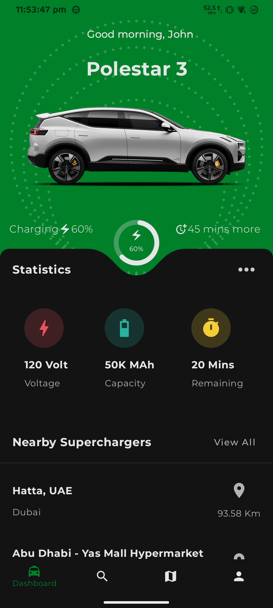
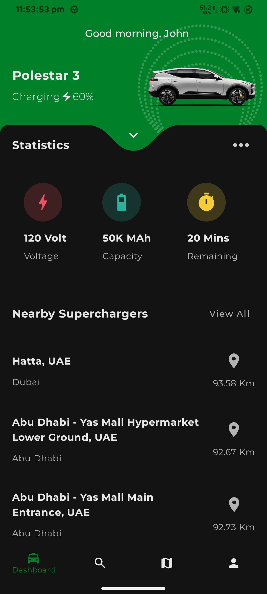
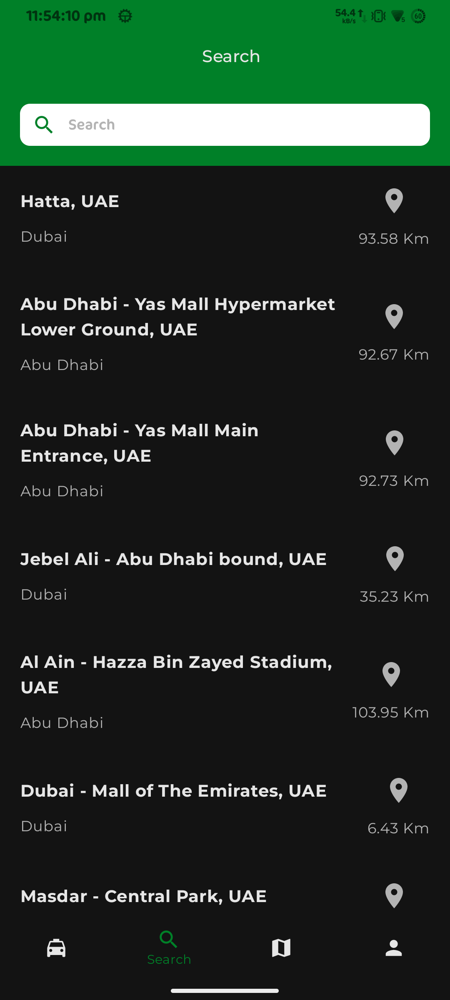
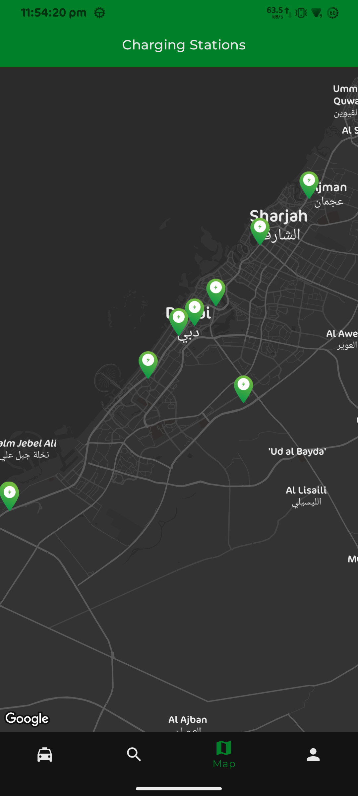
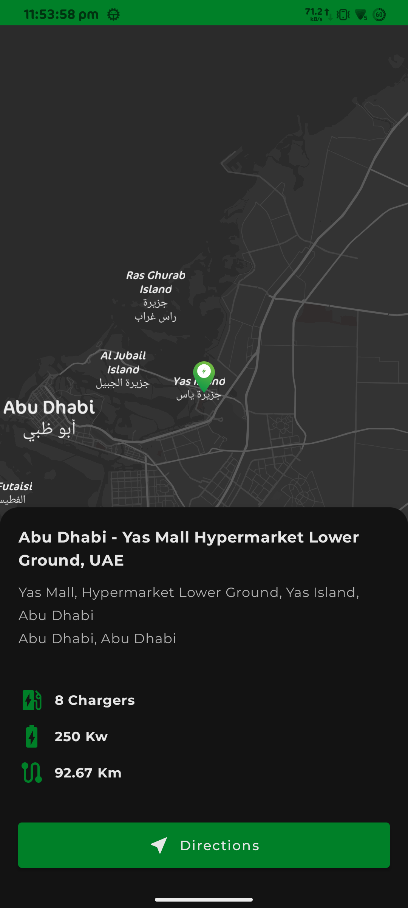
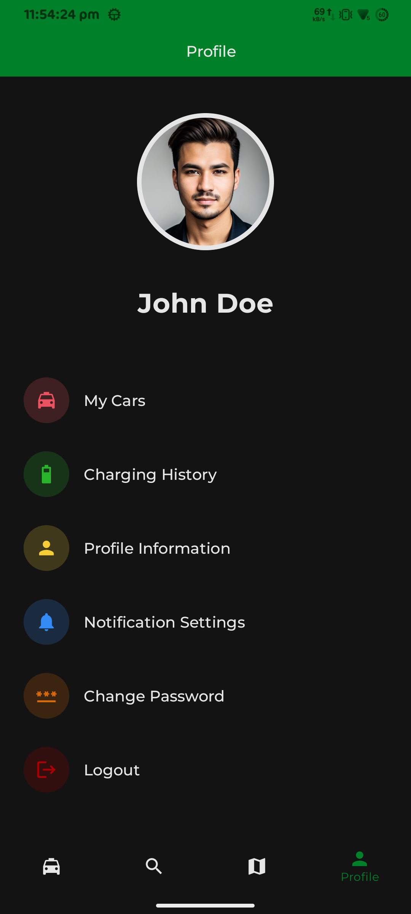

# ChargeApp

> A car car charging and battery information application with charger locations.
> Implemented using Kotlin, Jetpack Compose in MVVM architecture.

## Please find the documentation regarding the project.
The Project is implemented using below tools and architecture.

## Additional requirements to run the project
You need to add 'GOOGLE_MAPS_API_KEY' in 'local.properties' file in order to display the map.

Tools
  1. Android Studio Hedgehog | 2023.1.1
  2. Android Gradle Plugin Version: 8.2.0
  3. Gradle Version: 8.2
  4. Used Version Catalog for handling library dependencies

Architecture
  1. MVVM
  2. Jetpack Compose
  3. Hilt for Dependancy Injection
  4. Kotlin Serialization for serialization
  5. BackdropScaffold and MotionLayout to handle scroll animations.

Please find the project folder structure.

📦chargerapp  ┣ 📂data  ┃ ┣ 📂di  ┃ ┃ ┣ 📜ChargingStationRepositoryModule.kt  ┃ ┃ ┗ 📜DatastoreModule.kt  ┃ ┣ 📂models  ┃ ┃ ┗ 📜ChargerLocations.kt  ┃ ┗ 📂repository  ┃ ┃ ┗ 📜ChargingStationRepository.kt  ┣ 📂navigation  ┃ ┣ 📜AppBottomNavigation.kt  ┃ ┣ 📜AppState.kt  ┃ ┣ 📜BottomNavItem.kt  ┃ ┣ 📜NavigationGraph.kt  ┃ ┗ 📜Route.kt  ┣ 📂ui  ┃ ┣ 📂activity  ┃ ┃ ┗ 📜MainActivity.kt  ┃ ┣ 📂customviews  ┃ ┃ ┣ 📜ChargingCircularProgress.kt  ┃ ┃ ┣ 📜ChargingInfoView.kt  ┃ ┃ ┣ 📜ChargingStationListItem.kt  ┃ ┃ ┣ 📜CircularDottedCanvas.kt  ┃ ┃ ┣ 📜CommonAppBar.kt  ┃ ┃ ┣ 📜DottedDecorationView.kt  ┃ ┃ ┣ 📜RevealButton.kt  ┃ ┃ ┗ 📜SearchView.kt  ┃ ┣ 📂motionscene  ┃ ┃ ┗ 📜DashboardMotionScene.kt  ┃ ┣ 📂screens  ┃ ┃ ┣ 📂dashboard  ┃ ┃ ┃ ┣ 📂backdrop  ┃ ┃ ┃ ┃ ┣ 📜BackLayer.kt  ┃ ┃ ┃ ┃ ┗ 📜FrontLayer.kt  ┃ ┃ ┃ ┣ 📂viewmodel  ┃ ┃ ┃ ┃ ┗ 📜DashboardScreenViewModel.kt  ┃ ┃ ┃ ┗ 📜DashboardScreen.kt  ┃ ┃ ┣ 📂mapscreen  ┃ ┃ ┃ ┗ 📜MapScreen.kt  ┃ ┃ ┣ 📂stationdetails  ┃ ┃ ┃ ┣ 📜ChargingStationDetails.kt  ┃ ┃ ┃ ┗ 📜StationDetailsViewModel.kt  ┃ ┃ ┣ 📜ProfileScreen.kt  ┃ ┃ ┗ 📜SearchScreen.kt  ┃ ┣ 📂shape  ┃ ┃ ┗ 📜NotchedRoundedCorners.kt  ┃ ┗ 📂theme  ┃ ┃ ┣ 📜Color.kt  ┃ ┃ ┣ 📜Dimen.kt  ┃ ┃ ┣ 📜Theme.kt  ┃ ┃ ┗ 📜Type.kt  ┣ 📂utility  ┃ ┣ 📜Extensions.kt  ┃ ┗ 📜Utiliy.kt  ┗ 📜ChargerApp.kt

 Please find the screenshots below

https://github.com/rishadappat/ChargerApp/assets/12482829/df034988-cac4-45b0-8d84-ac3e4e136197
  
 <table>
  <tr>
    <td></td>
    <td></td>
  </tr>
   <tr>
    <td></td>
    <td></td>
  </tr>
    <tr>
    <td></td>
    <td></td>
  </tr>
 </table>

 # The curve implementation.
 The curved view implementation was derived from the below medium post.
 https://proandroiddev.com/how-i-drew-custom-shapes-in-bottom-bar-c4539d86afd7
 It was implemented using drawing paths using Bézier curves. Additionally I have added the curves at the beginning and the end of the shape to create the Rounded-cornered curve-notched shape.

 # The dashboard scroll and expanding headerview.
 I was planning to implement 'Collapsible Toolbar Layout' which was available in the older xml based desing in Android. But, nothing similar was available in compose. Then I have remembered about Backdrop View which was available in Flutter. I was implemented one in my ownproject as well. You can find the source code in the blow repository. 
 https://github.com/rishadappat/Bookledge 
 It was available for jetpack compose as well. So I have decided to implement it using BackdropScaffold. 
 # The animations
In Jetpack compose creating animations are a fun thing to do. And MotionLayout was an 'icing on a cake' feel. The MotionLayout is a combination of Constraints. When we add these constraints to the start and end positions, it will animate according to the progress value we are setting.
